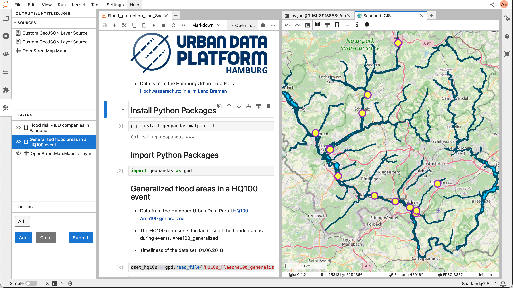
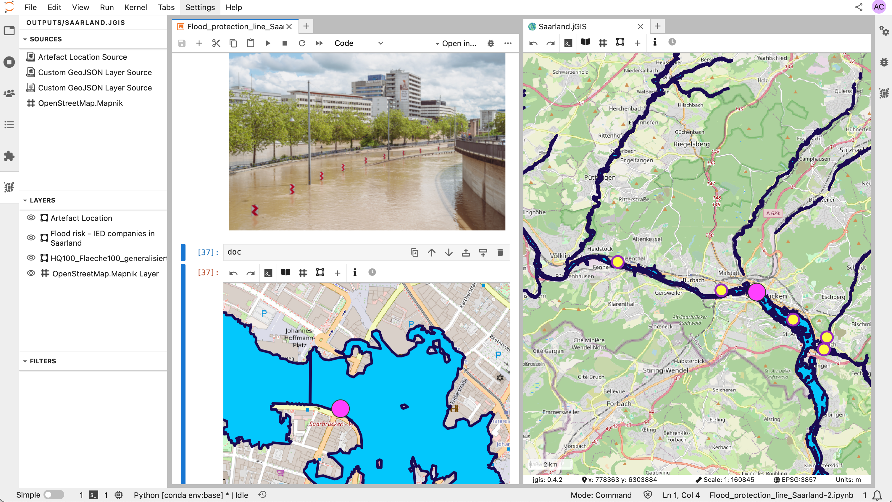

# Using JupyterGIS with the Urban Data Portal

## Introduction

These notebooks showcase how to use JupyterGIS.

We use JupyterGIS on the UseGalaxy.eu. The tool can be launched from [JupyterGIS in Galaxy Europe](https://usegalaxy.eu/root?tool_id=interactive_tool_jupytergis_notebook). Please prior to use it, register to [usegalaxy.eu](https://usegalaxy.eu/login/start) and authenticate yourself before starting it.

To help new users get started, there are two tutorials available:
- [Intro to JupyterGIS](https://jupytergis.readthedocs.io/en/latest/user_guide/tutorials/01-intro/index.html) a step-by-step guide for new users.
- [Collaborative Features Tutorial](https://training.galaxyproject.org/training-material/topics/climate/tutorials/jupytergis_collaboration/tutorial.html) — a guide for exploring real-time editing and shared annotations. 

## Outputs generated with JupyterGIS

